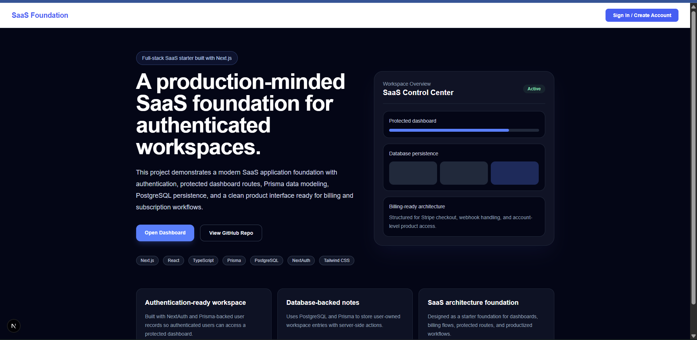
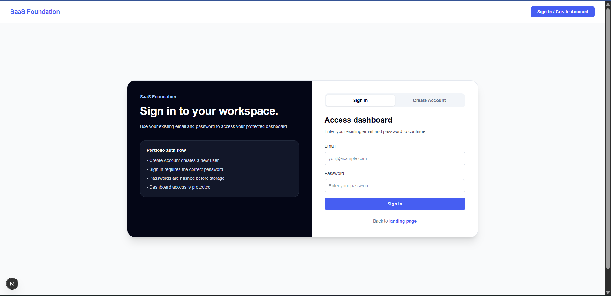
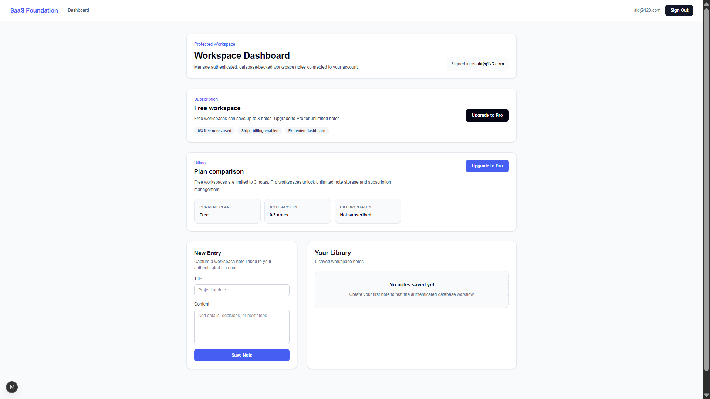
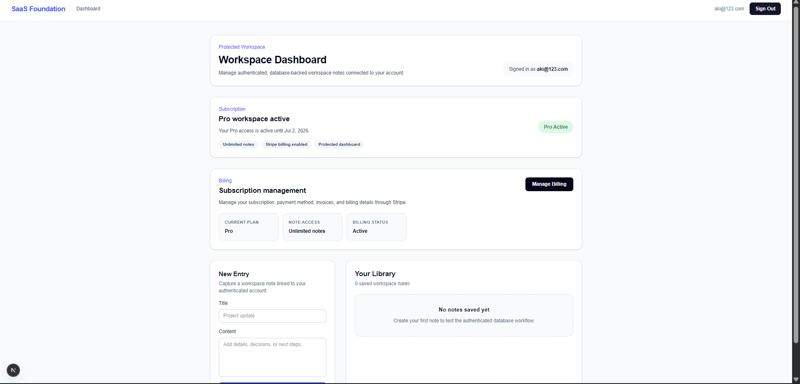
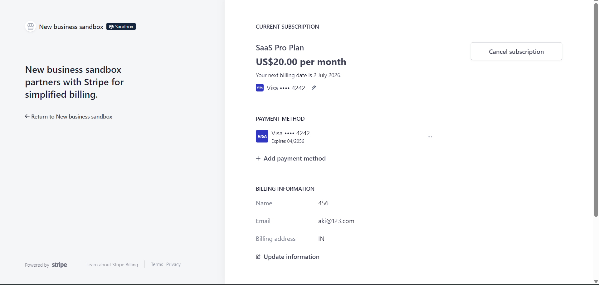

# SaaS Foundation

Security-focused full-stack subscription application built with Next.js, TypeScript, Prisma, PostgreSQL, NextAuth, and Stripe.

The project covers the full path from authentication and protected data to subscription lifecycle, webhook processing, operational health, abuse controls, dependency security, and regression testing.

## Engineering scope

- credentials authentication with explicit sign-in/signup policy
- bcrypt password hashing
- protected workspace data
- ownership-scoped server actions
- free/Pro entitlement logic
- Stripe Checkout and Customer Portal
- signed webhook processing
- subscription reconciliation
- database-backed rate limiting
- security headers
- database readiness endpoint
- CI lint/test/build/audit gates
- documented incident response and dependency-risk handling

## Architecture

```text
Browser
  │
  ▼
Next.js App Router
  ├── Credentials auth / session
  ├── Protected server actions
  ├── Workspace / notes
  ├── Billing actions
  ├── Health endpoint
  └── Stripe webhook
       │
       ├── signature verification
       ├── request/event correlation
       └── subscription state update
  │
  ├── Prisma Client
  │     └── PostgreSQL
  │
  └── Stripe API
```

## Authentication security incident

During review, the credentials provider exposed an account-boundary problem.

An existing user with `passwordHash = null` could enter credentials in sign-in mode and the application would create a new password hash from the submitted password.

That is unsafe because the existence of an email record does not prove the caller is allowed to establish a new authentication factor.

A regression test was committed first.

The fixed policy is explicit:

| Mode | User state | Result |
|---|---|---|
| signup | unused email | create account |
| signup | existing email | deny |
| signin | credentials account | verify password |
| signin | missing user | deny |
| signin | existing passwordless account | deny |

The fix also:

- centralizes credential policy
- normalizes email
- preserves password content exactly
- requires 12+ characters for signup
- hashes passwords with bcrypt
- prevents implicit conversion of passwordless accounts

Incident: [`docs/incidents/INC-001-passwordless-account-claim.md`](docs/incidents/INC-001-passwordless-account-claim.md)

## Billing reliability case study

The Stripe integration now defines explicit behavior for duplicate delivery, out-of-order events, superseded subscriptions, interrupted processing, and state repair.

Key decisions:

- persist Stripe event IDs with a database unique constraint
- commit the event record and entitlement update in one transaction
- reject stale events using the last applied Stripe event timestamp
- track subscription creation time so an old subscription cannot replace a newer one
- ignore deletion of a superseded subscription
- re-read current Stripe Subscription state for create/update events
- return non-2xx on processing failure so Stripe can retry
- provide a dry-run reconciliation command before any repair is applied

```bash
npm run billing:reconcile -- --email user@example.com
npm run billing:reconcile -- --email user@example.com --apply
```

Detailed incident note: [`docs/incidents/INC-002-stripe-webhook-reliability.md`](docs/incidents/INC-002-stripe-webhook-reliability.md)

Recovery runbook: [`docs/runbooks/subscription-reconciliation.md`](docs/runbooks/subscription-reconciliation.md)

**Verification limit:** automated tests verify ordering, entitlement and reconciliation policy. CI does not contain real Stripe credentials, so these tests are not presented as end-to-end Stripe test-mode webhook delivery.

## Billing security

Stripe handling includes:

- server-side Checkout creation
- Customer Portal authorization
- signed webhook verification
- generic webhook error responses
- request correlation IDs
- Stripe event IDs in server-side logs
- subscription created/updated/deleted handling
- fallback checkout-session synchronization
- entitlement changes driven from trusted server-side state

Webhook verifier details are not echoed back to callers.

## Authorization and data ownership

Workspace mutations derive ownership from the authenticated session.

Client-supplied user identity is not trusted for protected operations.

Deletion is scoped by both:

- resource ID
- authenticated user ID

Free-plan limits are enforced on the server.

## Operational health

```http
GET /api/health
```

The health route performs an actual database query.

Healthy:

```json
{
  "status": "ready",
  "checks": {
    "database": "ok",
    "billingSchema": "ok"
  }
}
```

Database failure returns HTTP 503 with a generic response while internal details remain in server logs.

## Browser hardening

Application responses include:

```text
X-Content-Type-Options: nosniff
X-Frame-Options: DENY
Referrer-Policy: strict-origin-when-cross-origin
Permissions-Policy: camera=(), microphone=(), geolocation=()
Cross-Origin-Opener-Policy: same-origin
```

## Dependency security

CI blocks high/critical issues in shipped dependencies.

During the security review, the dependency graph exposed vulnerable framework/auth packages. Remediation included:

- Next.js 16.3.7
- NextAuth 4.24.15
- Prisma Client / PostgreSQL adapter 7.10.0
- patched Preact 10.29.8

A separate risk register documents advisories still present in Prisma optional/development CLI tooling rather than pretending those advisories are runtime application exposure.

See [`docs/DEPENDENCY-RISK.md`](docs/DEPENDENCY-RISK.md).

## CI quality gates

```text
npm ci
npm audit --omit=dev --omit=optional --audit-level=high
npm run lint
npx prisma validate
npx prisma generate
npm test
npm run build
```

Final CI is green:

https://github.com/AC0731/saas-foundation/actions/runs/36568629100

## Core product features

### Authentication

- create account / sign in modes
- protected dashboard
- credential policy enforcement
- bcrypt password hashing
- sign-in rate limiting

### Workspace

- database-backed notes
- create/delete operations
- ownership checks
- free-plan limits
- Pro entitlement state

### Billing

- Stripe Checkout
- Customer Portal
- signed webhooks
- cancellation tracking
- subscription status synchronization

### UX

- loading state
- error state
- not-found state
- delete confirmation modal
- toast notifications

## Screenshots

### Landing



### Authentication



### Free workspace



### Pro billing state



### Stripe portal



## Testing

```bash
npm test
npm run lint
npx prisma validate
npm run build
```

Regression coverage includes:

- credential account policy
- passwordless account claim prevention
- subscription state transitions
- server-side product/business rules

## Security and operations documentation

- [Security model](docs/SECURITY-MODEL.md)
- [Authentication incident](docs/incidents/INC-001-passwordless-account-claim.md)
- [Production schema recovery incident](docs/incidents/INC-003-production-schema-bridge.md)
- [Dependency risk register](docs/DEPENDENCY-RISK.md)
- [Operations guide](docs/OPERATIONS.md)
- [Authentication and billing runbook](docs/runbooks/billing-and-auth-incidents.md)
- [Deployment notes](docs/DEPLOYMENT.md)

## Tech stack

- Next.js
- React
- TypeScript
- Prisma
- PostgreSQL
- NextAuth
- Stripe
- Tailwind CSS
- Vitest
- GitHub Actions

## Local development

```bash
npm install
npx prisma generate
npx prisma db push
npm run dev
```

Open:

```text
http://localhost:3000
```

## Environment

```env
DATABASE_URL=
NEXTAUTH_URL=
NEXTAUTH_SECRET=
STRIPE_SECRET_KEY=
STRIPE_WEBHOOK_SECRET=
STRIPE_PRICE_ID=
```

Never commit real secrets.

## Engineering decisions

**Authentication transitions are explicit.** An existing identity record cannot silently gain a new password credential.

**Authorization is resolved server-side.** Ownership comes from the authenticated session, not the browser.

**Billing state comes from trusted sources.** Client data is never sufficient to grant Pro access.

**Operational health checks dependencies.** A static “200 OK” is not treated as readiness.

**Security debt stays visible.** Toolchain advisories are tracked separately from shipped runtime dependencies.

## Author

Akanksha Chavda  
GitHub: AC0731
